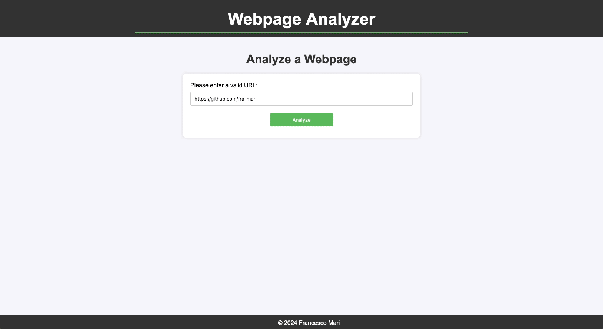

# Web Page Analyzer for Home24
_This repository contains **the solution to the Home24 coding challenge**_

  

### Description

This is a little web application written in the Go programming language. The user can input the URL of any website through the Front End interface, and the app returns a short analysis containing the following pieces of information:

- The **HTML version** used for writing the provided web page;
- The **title** of the page;
- The **number of headings** of the webpage, sorted by level;
- The **number of links contained in the webpage**, sorted by type: internal or external;
- The **number of inaccessible links**. 

The application also checks for the presence of any **login forms** in the web page.

To be sure, as it usually happens during web scraping tasks (including limited-scope ones like this one), **requests may not be successful for all web pages** for a number of reasons. In such cases, the application informs the user about the encountered error and attempts to provide meaningful, if short, insights about it.

|                                    |
| :----------------------------------------------------------: |
| <span style="color:grey"> <i><b>Fig. 1</b>: The Web Page Analyzer in action</i></span> |

---
### Implementation

#### Main features:
- I decided to keep the application as simple as possible, using [**Gin**](https://gin-gonic.com/) as a web framework and implementing a pleasant, yet minimal Front End;

- The backbone of the application is the `Analyzer` interface, which contains a `HTMLAnalyzer` and a `LinkChecker`, dealing with the two main tasks to be carried out, respectively.

	- The `HTMLAnalyzer` interface provides methods for going through the tokenized HTML and singling out the elements that the app aims at retrieving, based on their tags. This includes a list of links, which are then passed to the `LinkChecker`;
	- The `LinkChecker` interface is responsible for checking the availability of the links retrieved by the `HTMLAnalyzer`. It first checks that links are formally correct, and then, whenever applicable, **it performs GET requests in parallel**, in order to minimize the execution time, which may be significant for long HTML documents.

- At the end of the process, the results of the analysis (or the error message) are collected in a Golang _struct_ named `AnalysisResult` and passed to the server. They are thus integrated in the HTML templates and displayed by the Front End.         

#### Assumptions:
During the development, **it has been necessary to make a few assumptions** or to take arbitrary decisions: 

- Both **links** and **login forms** can be embedded into HTML in a number of ways. After some research, <u>I singled out some of these, and decided to concentrate on them</u>. The code has been written so as to allow easy extension should one decide to include other search strategies, but it should be noted that the application's output does not cover all possible scenarios;

- **Internal links are not "complete" by definition**. Accordingly, no GET request performed outside the website that contains them can succeed. For this to happen, before making the call, one should reconstruct their absloute path. Because my code <u>does not carry out such reconstruction</u>, **the application classifies them as _inaccessible_**, which I have deemed acceptable, because in the end their accessibility depends on one's point of view. From where should they be accessible?

- Needless to say, **it would have been possible to use Go routines more extensively** than what I have done. After several attempts, though, I decided to limit them to the `LinkChecker`, as I could not appreciate any significant performance improval by also employing them in the `HTMLAnalyzer` and I did not wish to needlessly complicate the code.
    
 

#### Tech Stack:
<p>


</p>


---
### How To Use This Code
#### 🔔&nbsp; Prerequisites

- [**Git**](https://www.git-scm.com/downloads)
- [**Go**](https://go.dev/dl/) (version 1.22 or higher)
- _Optional (but recommended)_: [**Docker**](https://www.docker.com/products/docker-desktop/)

First of all, **clone this repository** and **navigate inside the folder**:

```sh
git clone https://github.com/fra-mari/home24
cd home24
```    
 
Then, use the following instructions to build and start the application, either directly or, if you do not wish to install `Go`, using `Docker`. 
 
#### 📌&nbsp; Direct build, on UNIX systems

⚠️ **N.B.**: If you use a Windows system, or you prefer to use `Docker`, please follow the instructions [in the following paragraph](https://github.com/fra-mari/home24?tab=readme-ov-file#-docker-build-on-windows-and-on-unix-too-if-you-wish).

1. Ensure you have `Go` installed on your system. You can download it from the official [Go website](https://go.dev/dl/).

2. In the project directory, download the dependencies:
    
    ```sh
    go mod tidy
    ```
    
3. Build the application:     

    ```sh
    go build -o analyzer_build
    ```

	_Note_: The `-o` flag specifies the output file name. In this example, the compiled binary will be 	named `analyzer_build` and placed in the current directory.

4. Set the server to release mode:    
	
	```sh
    GIN_MODE=release
    ```
    
5. Start the application:
	
	```sh
    ./analyzer_build
    ```
        
The application will be accessible at `http://localhost:8080`. To gracefully shut it down, you may press `Ctrl+C`.

#### 📌&nbsp; Docker build, on Windows (and on UNIX, too, if you wish)

1. Ensure you have `Docker` installed on your system. You can download it from the official [Docker website](https://www.docker.com/products/docker-desktop/).


2. Build the Docker image:

    ```sh
    docker build -t analyzer .
    ```

3. Run the Docker container:

    ```sh
    docker run -p 8080:8080 analyzer
    ```

The application will be accessible at `http://localhost:8080`. To gracefully shut it down, you may press `Ctrl+C`.

---
### Possible Improvements and To Dos
- [ ] Add the **unit tests**. The code has been written with tests in mind: the `Analyzer` interface as well as the `HTMLAnalyzer` and `LinkChecker`interfaces allow for a straightforward implementation of mock methods, which in turn facilitates complete and granular testing of the business logic;
- [ ] **Implement strategies for preventing web pages from refusing requests** (403 Errors);
- [ ] **Improve the mechanism that tries to recognize login forms**, as the app currently identifies but a fraction of them, although significant; 
- [ ] **The code should be benchmarked to identifiy remaining bottlenecks that hinder performance**, so as to reformat and to adopt strategies to further boost the speed of the Analyzer, especially when it processes particularly long HTML documents.
